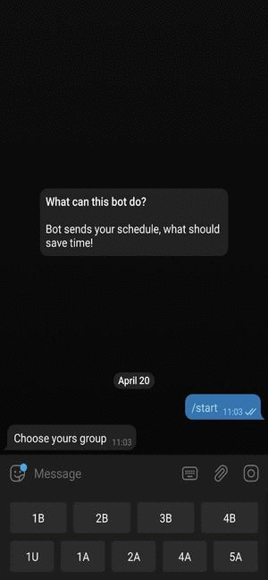

# TelegramScheduleBot

It's a C# program which uses Telegram Bot API to help you be in class on time. You can see an example of how it works:[`@zerowka_bot`](https://t.me/zerowka_bot).

[](https://t.me/BusVbot)
## Commands
* **/start** - lets you register or reset your account.
* **/help** - sends instruction manual for use. 
* **/send_again** - sends you schedule keyboard one more time.

## Getting Started 

1. You need to restore a backup copy of the MySQL database from the file *data-dump.sql* and fill it with data:
```bash
mysql -u username -p db_name < data-dump.sql 
```
2. Create file *data.xml* with the following structure: 
```xml
<data>
  <BotToken>Yours Bot Token here</BotToken>
  <DBConnString>connection string</DBConnString>
  
  <day-array>
    <item>Day name</item>
    <item>Day name</item>
    ...
  </day-array>

  <group-array>
    <item>Group name</item>
    <item>Group name</item>
    ...
  </group-array>
</data>
```
3. Build and try!